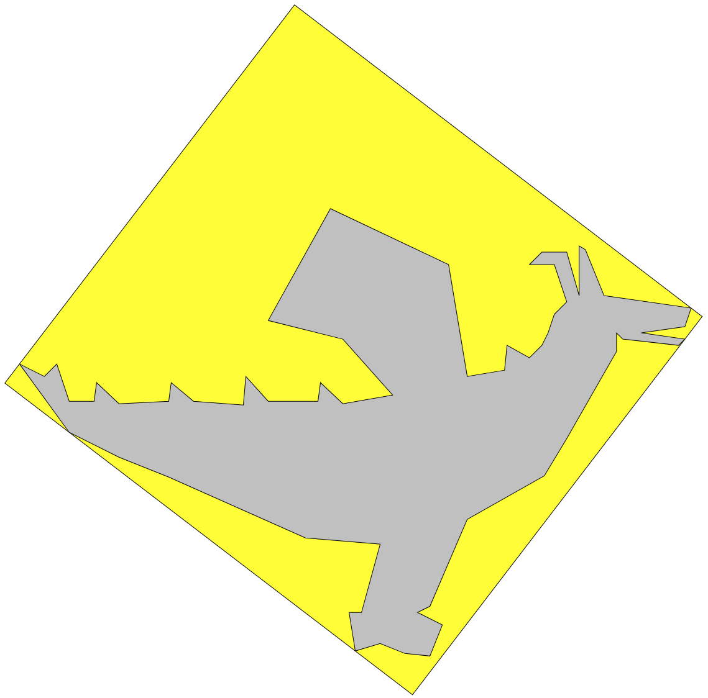
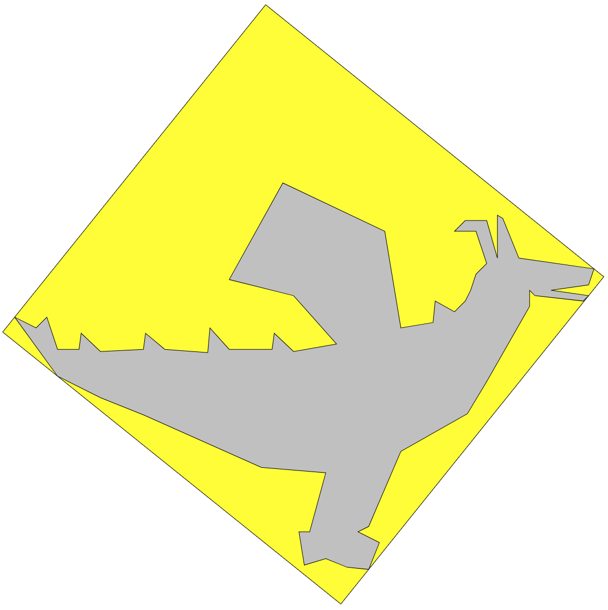

# bbox2d
Solving several 2D bounding box problems using rotating calibers algorithm

## Examples

  - **command**: 
> bbox2d examples/dragon.poly

  - **output**:

| Minimum area bounding box        | Minimum perimeter bounding box           | 
| ------------- |:-------------:|
|       |  |

